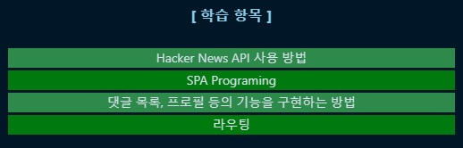

# 반드시 만들 수 있어야 하는 앱 8선
## Trello 클론 앱

 

 

## 사용자 관리 대시 보드

 

 

## 암호 통화 추적기

 

 

## Webpack 처음부터 설정하기

 

 

## [HackerNews 클론 앱](https://github.com/InSeong-So/AppYouMustCreate/tree/main/hacker-news)

<!-- 학습 항목 -->

<!-- 학습 이력 테이블 -->
<table>
    <thead>
        <th>일자</th>
        <th>내용</th>
    </thead>
    <tbody>
        <td>2021.04.21</td>
        <td>API 사용 방법, 라우팅, SPA 맛보기</td>
    </tbody>
</table>

 

 

## TO-DO 앱

<!-- 학습 항목 -->

<!-- 학습 이력 테이블 -->
<table>
    <thead>
        <th>일자</th>
        <th>내용</th>
    </thead>
    <tbody>
        <td>-</td>
        <td>-</td>
    </tbody>
</table>

 

 

## 드래그 앤 드롭으로 정렬 가능한 앱

 

 

## 메신저 클론 앱

 

 

## 참조
- [블로그](https://tagilog.tistory.com/579)
